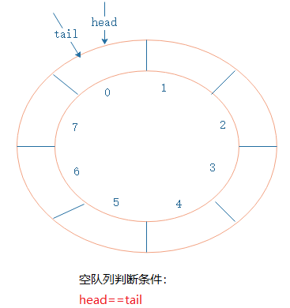

# 算法


***


# 数据结构


## 稀疏数组(sparse array)


编写的五子棋程序中，有存盘退出和续上盘的功能。


因为该二维数组的很多值是默认值 0, 因此记录了 很多没有意义的数据.-> 

### 基本介绍

当一个数组中大部分元素为０，或者为同一个值的数组时，可以使用稀疏数组来保存该数组。

稀疏数组的处理方法是:
1) 第一行，记录数组 一共有几行几列，有多少个不同的值
2) 其他行，把具有不同值的元素的行列及值记录在一个小规模的数组中，从而 缩小程序的规模


如下左边为原始数组 右边为稀疏数组

它能够省去很多重复的数字


**应用实例**

地图，棋盘


### 代码


``` java
public class sparseArray {
  public static void main (String[] args){
    int[][] chess = new int[11][11];
    chess[1][2] = 1;
    chess[2][3] = 2;

    int[][] sparseArray = toSparseArray(chess);
    for (int[] row:sparseArray){
      for (int aint: row){
          System.out.print(aint+" ");
      }
      System.out.println();
    }

    int[][] array = toArray(sparseArray);
    for (int[] row:array){
      for (int aint: row){
          System.out.print(aint+" ");
      }
      System.out.println();
    }
  }

  // 转为稀疏数组
  public static int[][] toSparseArray(int[][] array){
    int valueNum = 0;
    // 遍历非0个数
    for (int[] row: array){
      for (int data: row){
        if (data != 0){
          valueNum++;
        }
      }
    }

    // 定义稀疏数组
    int[][] sparseArray = new int[valueNum+1][3];
    sparseArray[0] = new int[]{array.length,array[0].length,valueNum};
    int count = 0;
    for (int i = 0; i < array.length; i++){
      for (int j = 0; j < array.length; j++){
        if(array[i][j] != 0){
          count++;
          sparseArray[count][0] = i;
          sparseArray[count][1] = j;
          sparseArray[count][2] = array[i][j];
        }
      }
    }
    return sparseArray;
  }

  //转为普通数组
  public static int[][] toArray(int[][] sparseArray){
    int[][] array = new int[sparseArray[0][0]][sparseArray[0][1]];
    for (int i = 1; i < sparseArray.length; i++){
      array[sparseArray[i][0]][sparseArray[i][1]] = sparseArray[i][2];
    }
    return array;
  }
}


```

结果如下

上面为原数组

下面为稀疏数组


***


## 队列


队列中有一种重要的队列叫做环形队列。

环形队列，其实是队列尾部和首部相接的结构，初始状态时，head和tail指针分别指向下标为0的位置，如图：



需要关注：**循环队列为空的判断条件是head==tail。**

随着新元素入队，head指针保持不边，tail指针往后移动，指向一个空闲位置。同样当有元素出队列时，head指针也会自然往后移动。


### 代码

**Java**

```java
import java.util.Scanner;

import javax.management.RuntimeErrorException;

public class cycleArrayQueue {
  public static void main(String[] args) {
    CircleArray Queue = new CircleArray(8);
    char key = ' '; // 接受用户输入
    Scanner scan = new Scanner(System.in);
    boolean loop = true;

    while (loop) {
      System.out.println("s(show): 显示队列");
      System.out.println("e(exit): 退出程序");
      System.out.println("a(add):  添加数据到队列");
      System.out.println("g(get):  从队列中取出数据");
      System.out.println("h(head): 查看队列头数据");
      key = scan.next().charAt(0); // 收字符指令
      switch (key) {
        case 's':
          try{
            Queue.showQueue();
          }catch(Exception e){
            e.printStackTrace();
          }
          break;
        case 'e':
          System.out.println("退出程序");
          loop = false;
          break;
        case 'a':
          System.out.println("請輸入要入列的數");
          int value = scan.nextInt();
          try{
            Queue.addElement(value);
          }catch(Exception e){
            e.printStackTrace();
          }
          break;
        case 'g':
          try{
            System.out.println(Queue.getElement());
          }catch(Exception e){
            e.printStackTrace();
          }
          break;
        case 'h':
          try{
            Queue.getHead();
          }catch(Exception e){
            e.printStackTrace();
          }
          break;
        default:
          break;
      }

    }

  }

}

class CircleArray {
  private int maxSize; // 最大容量
  private int front; // 队列头
  private int rear; // 队列尾后一个为空的位置
  private int[] arr; // 存放数据的队列
  // private boolean maxDist; // 判断是否刚好相差一圈首尾相连,可以让实际容量 == 最大容量

  // 构造函数创建队列
  public CircleArray(int arrMaxSize) {
    arr = new int[arrMaxSize];
    front = 0;
    rear = 0;
    maxSize = arrMaxSize;
    // maxDist = false;
  }

  // 判断队列是否为满
  public boolean isFull() {
    if ((rear + 1)%maxSize == front) {
      return true;
    }
    return false;
  }

  // 判断队列是否为空
  public boolean isEmpty() {
    if (front == rear) {
      return true;
    }
    return false;
  }

  // 加入元素
  public void addElement(int Element) {
    if (isFull()) {
      throw new RuntimeException("队列满，不能加入元素");
    }
    arr[rear] = Element;
    rear++;
    rear = rear % maxSize; // 当到达maxSize位置归0
  }

  // 提出元素
  public int getElement() {
    int temp; // 临时保存变量
    if (isEmpty()) {
      throw new RuntimeException("队列空，不能提取元素");
    }
    temp = arr[front];
    front++;
    front = front % maxSize;
    return temp;
  }

  // 遍历所有的元素
  public void showQueue() {
    if (isEmpty()) {
      throw new RuntimeException("队列空，不能提取元素");
    }
    for (int i = front; (i % maxSize) != rear; i++) {
      System.out.printf("arr[%d]=%d\n", i % maxSize, arr[i % maxSize]);
    }
  }

  // 显示头元素
  public int getHead() {
    if (isEmpty()) {
      throw new RuntimeException("队列空，不能顯示元素");
    }
    return arr[front];
  }
}

```


***


## 链表


如下所示，灰色的分别为头节点和尾部为空的节点，均不存放数据。

arrow为 箭头 指向下一个节点。


**插入节点**

如下在2-4之间插入一个3节点


让2节点箭头指向3节点，3节点箭头指向4

最终变成如下


**删除节点**

要删除3节点，则是让2节点箭头直接指向4节点即可，3节点不用管。


### 单链表

``` java

class ShipNodesList{
  // 定义头结点，不要修改
  private ShipNode head = new ShipNode(0, "", "");
  
  //添加节点到尾部
  public void add(ShipNode newNode){
    ShipNode temp = head;

    while (true){
      if(temp.next == null){
        break;
      }
      temp = temp.next; // 记录最后一个为空的节点
    }
    temp.next = newNode;
  }

  // 按照no的顺序添加(插入)节点
  public void addByNo(ShipNode shipNode){
    ShipNode temp = head;
    while (true){
      if(temp.next == null){
        temp.next = shipNode;
        return;
      }else if (temp.next.no == shipNode.no){
        throw new RuntimeException("节点 "+shipNode.no+" 已存在,请调用changeNode()函数修改");
      }else if (temp.next.no > shipNode.no){
        ShipNode temp2 = temp.next;
        temp.next = shipNode;
        shipNode.next = temp2;
        return;
      }
      temp = temp.next;
    }
  }

  // 删除 node.no == i 的节点
  public void deleteNode(int i){
    ShipNode temp = head;
    while (true){
      if (temp.next == null || temp.next.no > i){ // 判断为null必须放在前面
        throw new RuntimeException("链表中不存在节点 "+ i);
      }else if(temp.next.no == i) {
        temp.next = temp.next.next;
        return;
      }
      temp = temp.next;
    }
  }

  // 修改节点数据
  public void changeNode(int i, String sName, String sClassName){
    ShipNode temp = head;
    while (true){
      if (temp.next == null || temp.next.no > i){ // 判断为null必须放在前面
        throw new RuntimeException("链表中不存在该节点 " + i);
      }else if(temp.next.no == i) {
        temp = temp.next;
        temp.name = sName;
        temp.className = sClassName;
        System.out.println("修改成功：" + temp.toString());
        return;
      }
      temp = temp.next;
    }
  }

  // 显示链表
  public void showList(){
    // 
    if(head.next == null){
      System.out.println("链表为空");
      return;
    }
    ShipNode temp = head;
    while (true){
      if (temp == null){ 
        break;
      }
      System.out.println(temp);
      temp = temp.next;
    }

  }
}

// 定义单个节点
class ShipNode{
  public int no; // 节点序号
  public String name; // data数据
  public String className; // data数据
  public ShipNode next; // 指向下一个节点

  //构造器
  public ShipNode(int sNo, String sName, String sClassName){
    this.no = sNo;
    this.name = sName;
    this.className = sClassName;
  }

  // 添加toString方法
  @Override
  public String toString(){
    String nextStr = next == null ? "null" : "" + next.no; // 空则输出null  否则输出号码
    return "ShipNode [node=" + no + ", className=" + className + ", name=" + name + ", next=" + nextStr + "]";
  }
}
```


### 双向链表

链表有头节点和尾节点，每个节点有prev arrow(指向上一个节点)、next arrow(指向下一个节点)

``` java
class ShipNodesList{
  // 定义头结点，不要修改
  private ShipNode head = new ShipNode(0, "", "");
  
  //添加节点到尾部
  public void add(ShipNode newNode){
    ShipNode temp = head;

    while (true){
      if(temp.next == null){
        break;
      }
      temp = temp.next; // 记录最后一个为空的节点
    }
    newNode.prev = temp;
    temp.next = newNode;
  }

  // 按照no的顺序添加(插入)节点
  public void addByNo(ShipNode shipNode){
    ShipNode temp = head;
    while (true){
      if(temp.next == null){
        temp.next = shipNode;
        shipNode.prev = temp;
        return;
      }else if (temp.next.no == shipNode.no){
        throw new RuntimeException("节点 "+shipNode.no+" 已存在,请调用changeNode()函数修改");
      }else if (temp.next.no > shipNode.no){
        ShipNode temp2 = temp.next;
        temp.next = shipNode;
        shipNode.next = temp2;

        temp2.prev = shipNode;
        shipNode.prev = temp;
        return;
      }
      temp = temp.next;
    }
  }

  // 删除 node.no == i 的节点
  public void deleteNode(int i){
    ShipNode temp = head;
    while (true){
      if (temp.next == null || temp.next.no > i){ // 判断为null必须放在前面
        throw new RuntimeException("链表中不存在节点 "+ i);
      }else if(temp.next.no == i) {
        temp.next = temp.next.next;
        temp.next.prev = temp;
        return;
      }
      temp = temp.next;
    }
  }

  // 修改节点数据
  public void changeNode(int i, String sName, String sClassName){
    ShipNode temp = head;
    while (true){
      if (temp.next == null || temp.next.no > i){ // 判断为null必须放在前面
        throw new RuntimeException("链表中不存在该节点 " + i);
      }else if(temp.next.no == i) {
        temp = temp.next;
        temp.name = sName;
        temp.className = sClassName;
        System.out.println("修改成功：" + temp.toString());
        return;
      }
      temp = temp.next;
    }
  }

  // 显示链表
  public void showList(){
    // 
    if(head.next == null){
      System.out.println("链表为空");
      return;
    }
    ShipNode temp = head;
    while (true){
      if (temp == null){ 
        break;
      }
      System.out.println(temp);
      temp = temp.next;
    }

  }
}

// 定义单个节点
class ShipNode{
  public int no;
  public String name;
  public String className;
  public ShipNode prev;
  public ShipNode next;

  //构造器
  public ShipNode(int sNo, String sName, String sClassName){
    this.no = sNo;
    this.name = sName;
    this.className = sClassName;
  }

  // 添加toString方法
  @Override
  public String toString(){
    String prevStr = prev == null ? "null" : "" + prev.no;
    String nextStr = next == null ? "null" : "" + next.no; // 空则输出null  否则输出号码
    return "ShipNode [node=" + no + ", prev="+ prevStr + ", className=" + className + ", name=" + name + ", next=" + nextStr + "]";
  }
}
```


### 环形双向链表

链表只有一个头节点(head)作为遍历的标记，尾部节点next arrow 指向头节点(head)，头节点 prev arrow指向 尾部节点

``` java
class ShipNodesList{
  // 定义头结点，不要修改
  private ShipNode head = new ShipNode(0, "", "");
  
  //添加节点到尾部
  public void add(ShipNode newNode){
    if(head.next == null){
      newNode.prev = head;
      newNode.next = head;
      head.next = newNode;
      head.prev = newNode;
      return;
    }
    ShipNode temp = head.prev;
    newNode.prev = temp;
    newNode.next = head;
    temp.next = newNode;
    head.prev = newNode;
    return;
  }

  // 按照no的顺序添加(插入)节点
  public void addByNo(ShipNode shipNode){
    ShipNode temp = head;
    while (true){
      if (temp.next == null){
        temp.next = shipNode;
        shipNode.prev = temp;

        shipNode.next = temp;
        temp.prev = shipNode;
        return;
      }
      if(temp.next.no == 0){
        ShipNode temp2 = temp.next;
        temp.next = shipNode;
        shipNode.prev = temp;

        shipNode.next = temp2;
        temp2.prev = shipNode;
        return;
      }else if (temp.next.no == shipNode.no){
        throw new RuntimeException("节点 "+shipNode.no+" 已存在,请调用changeNode()函数修改");
      }else if (temp.next.no > shipNode.no){
        ShipNode temp2 = temp.next;
        temp.next = shipNode;
        shipNode.prev = temp;

        shipNode.next = temp2;
        temp2.prev = shipNode;
        return;
      }
      temp = temp.next;
    }
  }

  // 删除 node.no == i 的节点
  public void deleteNode(int i){
    ShipNode temp = head;
    while (true){
      if (temp.next.no == 0 || temp.next.no > i){ // 判断为null必须放在前面
        throw new RuntimeException("链表中不存在节点 "+ i);
      }else if(temp.next.no == i) {
        if (temp.prev.no == i ){ // 只剩头节点与另一节点
          temp.next = null;
          temp.prev = null;
          return;
        }
        temp.next = temp.next.next;
        temp.next.prev = temp;
        return;
      }
      temp = temp.next;
    }
  }

  // 修改节点数据
  public void changeNode(int i, String sName, String sClassName){
    ShipNode temp = head;
    while (true){
      if (temp.next.no == 0 || temp.next.no > i){ // 判断为null必须放在前面
        throw new RuntimeException("链表中不存在该节点 " + i);
      }else if(temp.next.no == i) {
        temp = temp.next;
        temp.name = sName;
        temp.className = sClassName;
        System.out.println("修改成功：" + temp.toString());
        return;
      }
      temp = temp.next;
    }
  }

  // 显示链表
  public void showList(){
    // 
    if(head.next == null){
      System.out.println("链表为空");
      return;
    }
    System.out.println(head);
    ShipNode temp = head.next;
    while (true){
      if (temp.no == 0){ 
        break;
      }
      System.out.println(temp);
      temp = temp.next;
    }

  }
}

// 定义单个节点
class ShipNode{
  public int no;
  public String name;
  public String className;
  public ShipNode prev;
  public ShipNode next;

  //构造器
  public ShipNode(int sNo, String sName, String sClassName){
    this.no = sNo;
    this.name = sName;
    this.className = sClassName;
  }

  // 添加toString方法
  @Override
  public String toString(){
    return "ShipNode [node=" + no + ", prev="+ prev.no + ", className=" + className + ", name=" + name + ", next=" + next.no + "]";
  }
}
```


***


## 栈

栈是一个抽象的概念，它是一系列可修改数据的有序集合。

它准照先进后出，后进先出的原则。


### 基本数字栈

Java 

``` java
package src.Stake;

import java.util.Scanner;

public class ArrayStakeDemo {
  public static void main(String[] args) {
    ArrayStack stack = new ArrayStack(4);
    String key = "";
    boolean loop = true;
    Scanner scanner = new Scanner(System.in);

    while (loop) {
      System.out.println("show:显示栈");
      System.out.println("exit:退出程序");
      System.out.println("push:表示数据入栈");
      System.out.println("pop:表示出栈");
      System.out.println("请输入选择");

      key = scanner.next();
      switch (key) {
        case "show":
          try {
            stack.showStack();
          } catch (Exception e) {
            //TODO: handle exception
            System.out.println(e.getMessage());
          }
          break;
        case "exit":
          System.out.println("退出程序");
          loop = false;
          break;
        case "push":
          int value = scanner.nextInt();
          stack.push(value);
          break;
        case "pop":
          try {
            int res = stack.pop();
            System.out.printf("出栈的数据是：%d\n", res);
          } catch (Exception e) {
            // TODO: handle exception
            System.out.println(e.getMessage());
          }
          break;
        default:
          break;
      }
    }
    scanner.close();
  }
}

class ArrayStack {
  private int maxSize; // 栈的大小
  private int[] stack; // 数组
  private int top = -1; // top表示栈顶

  // 构造器初始化栈
  public ArrayStack(int maxSize) {
    this.maxSize = maxSize;
    stack = new int[this.maxSize];
  }

  // 检查是否为满
  public boolean isFull() {
    return top == maxSize - 1;
  }

  // 检查是否为空
  public boolean isEmpty() {
    return top == -1;
  }

  // 入栈
  public void push(int value) {
    if (isFull()) {
      System.out.println("栈满");
      return;
    }
    top++;
    stack[top] = value;
  }

  // 出栈
  public int pop() {
    if (isEmpty()) {
      throw new RuntimeException("栈空");
    }
    int temp = stack[top];
    top--;
    return temp;
  }

  // 遍历展示栈
  public void showStack() {
    if (isEmpty()) {
      throw new RuntimeException("栈空");
    }
    for (int i = top; i >= 0; i--) {
      System.out.printf("Stack[%d] = %d\n", i, stack[i]);
    }
  }
}

```


### 案例


[简单中缀计算器calculator.java'](src\Stack)

[后缀计算器SuffixCalculator.java](src/Stack)


***

# LeetCode


[LeetCode](./LeetCode.md)


