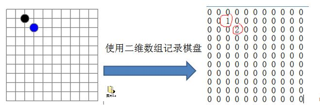

# 算法

## 时间复杂度

度量一个程序**执行时间**的两种方法

1) 事后统计的方法
这种方法可行, 但是有两个问题：一是要想对设计的算法的运行性能进行评测，需要实际运行该程序；二是所得时间的统计量依赖于计算机的硬件、软件等环境因素, 这种方式，要在同一台计算机的相同状态下运行，才能比较那个算法速度更快。
2) 事前估算的方法
通过分析某个算法的 时间复杂度来判断哪个算法更优.


### 时间频度

时间频度：一个算法花费的时间与算法中语句的执行次数成正比例，哪个算法中语句执行次数多，它花费时间就多。 一个算法中的语句执行次数称为语句频度或时间频度。记为 T(n)。[举例说明]


``` java
int sum = 0;
int end = 100;
for (int i = 0; i < end ; i++){
    end += sum;
} 
// 这个算法时间频度为  T(n) = n+1
/* ==================== */

int sum = (1+100)*50/2; 
// 这个算法的时间频度为 T(n) = 1
```


根据不同的算法我们可以得出不同的时间频度

如双层 for 循环为 T(n) = n^2 +n +1


算法比较的时候我们优先比较 最大次方的大小 如 6n^2+23n  与 2n^3+6n

我们认为 6n^2 算法更优(忽略低次方 23n 与 6n)

相同次方的时候 再比较系数 如 6n^2+7n 与 2n^2+17n

我们认为 2n^2 更优(忽略低次方 7n 与 17n)


***

## 递归

###  迷宫问题


#### 基本实现

[基本迷宫实现](src\Recursion\MazeTest.java)


#### 最优路径问题

如下为一个迷宫

根据编程习惯，我们设置为 起点为(2,1)，终点为(3,5)


如果要递归计算到终点的路径非常简单。

但如果是要计算最优的路径那么增加了很大的难度。


因此我们要在计算路径的基础上添加一些属性。

**LCP 最低成本路径(无障碍路径)**：（1,4）= (3,5) - (2,1)  这个结果没有烤炉到障碍，它的成本为5次 (1+4)，

**LACP 最低实际成本路径**：考虑障碍情况下的最优路径，本案例成本为9次

**ACP 实际成本路径**： 在测试寻找过程中实际使用的

在最低成本路径下我们允许 向下走1格 向右走4格(无障碍最优)，每超出偏离最低成本路径1格，都需要再消耗一格 来回到原来的路径

如下为实际最低成本路径(LACP) 为 9次


如下为实际成本路径(ACP) 为11 次


通过比较ACP > LACP(假设)，因此淘汰掉ACP，认为ALCP更优

如果 ACP < LACP， 那么 认为ACP更优 赋值 LACP = ACP， 然后继续寻找更优路径

综上我们需要不断地比较不同的ACP得到 最优LACP


**代码：**

[最优路径](src/Recursion/BestPath.java)


***


### 八皇后问题

八皇后问题是一个古老而注明的问题，是回溯算法的经典案例。该问题是国际西洋棋棋手马克斯·贝瑟尔于1848 年提出：在 8×8 格的国际象棋上摆放八个皇后，使其不能互相攻击，即： 任意两个皇后都不能处于同一行 、
同一列或同一斜线上，问有多少种摆法(92，排除旋转对称后为23=(92/4))。


**解决方案**

1) 第一个皇后先放第一行第一列
2) 第二个皇后放在第二行第一列、然后判断是否 OK， 如果不 OK，继续放在第二列、第三列、依次把所有列都
放完，找到一个合适
3) 继续第三个皇后，还是第一列、第二列……直到第 8 个皇后也能放在一个不冲突的位置，算是找到了一个正确
解
4) 当得到一个正确解时，在栈回退到上一个栈时，就会开始回溯，即将第一个皇后，放到第一列的所有正确解，
全部得到.
5) 然后回头继续第一个皇后放第二列，后面继续循环执行 1,2,3,4 的步骤

理论上应该创建一个二维数组来表示棋盘，但是实际上可以通过算法，用一个一维数组即可解决问题. arr[8] ={0 , 4, 7, 5, 2, 6, 1, 3} //对应 arr 下标 表示第几行，即第几个皇后，arr[i] = val , val 表示第 i+1 个皇后，放在第 i+1行的第 val+1 列


**代码实现**

[八皇后回溯算法](src/Recursion/EightQueenTest.java)


***


## 排序算法

排序算法是算法中常见的，它有多种实现方法


### 冒泡排序

冒泡排序（Bubble Sorting）的基本思想是：通过对待排序序列从前向后（从下标较小的元素开始）, 依次比较相邻元素的值，若发现逆序则交换，使值较大的元素逐渐从前移向后部，就象水底下的气泡一样逐渐向上冒。

优化：
因为排序的过程中，各元素不断接近自己的位置， 如果一趟比较下来没有进行过交换 ， 就说明序列有序，因此要在排序过程中设置一个标志 flag 判断元素是否进行过交换。从而减少不必要的比较。(这里说的优化，可以在冒泡排序写好后，在进行)


``` java
public class Bubble{
  public static int[] sort(int[] arr){
    int temp;
    // i 为最小待放入的较小的数字的位置
    for (int i = 0; i < arr.length; i++) {
      for (int j = i + 1; j < arr.length; j++) {
        if(arr[i] > arr[j]){
            temp = arr[i];
            arr[i] = arr[j];
            arr[j] = temp;
        }
      }
    }
    return arr;
  }
}
```


### 选择排序

选择排序（select sorting）也是一种简单的排序方法。它的基本思想是：

第一次从 ```arr[0]~arr[n-1]```中选取最小值，与 ```arr[0]```交换，

第二次从 ```arr[1]~arr[n-1]```中选取最小值，与```arr[1]```交换，

第三次从 ```arr[2]~arr[n-1]```中选取最小值，与 ```arr[2]```交换，…，第 i 次从 ```arr[i-1]~arr[n-1]```中选取最小值，与 ```arr[i-1]```交换，

…, 

第 n-1 次从 ```arr[n-2]~arr[n-1]```中选取最小值，与``` arr[n-2]```交换，

总共通过 n-1 次，得到一个按排序码从小到大排列的有序序列，

优化：**每次可以同时选择最大与最小值**


``` java
public static int[] sort(int[] arr){
    int min;
    int minIndex;
    int temp;

    for (int i = 0; i < arr.length; i++) {
      min = arr[i];
      minIndex = i;

      // 查找最小值
      for (int j = i; j < arr.length; j++) {
        if(arr[j] < min){
          min = arr[j];
          minIndex = j;
        }
      }
      // 最小交换
      temp = arr[i];
      arr[i] = min;
      arr[minIndex] = temp;
    }
    return arr;
  }

  public static int[] doubleSort(int[] arr){
    int max;
    int maxIndex;
    int min;
    int minIndex;
    int temp;

    for (int i = 0; i <= arr.length - i ; i++) {
      max = arr[i];
      maxIndex = i;
      min = arr[i];
      minIndex = i;

      for (int j = i; j < arr.length - i; j++) {
        if(arr[j] < min){
          min = arr[j];
          minIndex = j;
        }
        if(arr[j] > max){
          max = arr[j];
          maxIndex = j;
        }
      }
      // 最小交换
      temp = arr[i];
      arr[i] = min;
      arr[minIndex] = temp;
      // 最大交换
      temp = arr[arr.length - 1 - i];
      arr[arr.length - 1 - i] = max;
      arr[maxIndex] = temp;
    }

    return arr;
  }
```


### 插入排序

插入排序（Insertion Sorting）的基本思想是：把 把 n 个待排序的元素看成为一个有序表和一个无序表，开始时 有序表中只包含一个元素，无序表中包含有 n-1 个元素，排序过程中每次从无序表中取出第一个元素，把它的排序码依次与有序表元素的排序码进行比较，将它插入到有序表中的适当位置，使之成为新的有序表。


``` java
public class Insertion {
  public static int[] sort(int[] arr){
    int insertVal;
    int insertIndex;

    for (int i = 1; i < arr.length; i++) {
      // 待插入的数值
      insertVal = arr[i];
      insertIndex = i - 1;
      while (insertIndex >= 0 && insertVal < arr[insertIndex] ){
        arr[insertIndex + 1] = arr[insertIndex];
        insertIndex--;
      }
      arr[insertIndex + 1] = insertVal;
    }

    return arr;
  }
}
```


### 希尔排序

希尔排序是希尔（Donald Shell）于 1959 年提出的一种排序算法。希尔排序也是一种 插入排序，它是简单插入排序经过改进之后的一个 更高效的版本，也称为 缩小增量排序。

希尔排序是把记录按下标的一定增量分组，对每组使用直接插入排序算法排序；随着增量逐渐减少，每组包含的关键词越来越多， 当增量减至 1 时，整个文件恰被分成一组，算法便终止

图示如下


``` java
public class Shell {
  public static int[] sort(int[] arr){
    int gap = arr.length/2;
    int insertVal;
    int insertIndex;

    while (gap >= 1 ){
      for (int i = gap; i < arr.length; i+=gap) {
        insertVal = arr[i];
        insertIndex = i - gap;
        while (insertIndex >= 0 && insertVal < arr[insertIndex]){
          arr[insertIndex + gap] = arr[insertIndex];
          insertIndex -= gap;
        }
        arr[insertIndex + gap] = insertVal;
      }
      gap = gap/2;
    }

    return arr;
  }
}
```


### 快速排序

快速排序（Quicksort）是对 冒泡排序的一种改进。基本思想是：通过一趟排序将要排序的数据分割成独立的两部分，其中一部分的所有数据都比另外一部分的所有数据都要小，然后再按此方法对这两部分数据分别进行快速排序， 整个排序过程可以递归进行，以此达到整个数据变成有序序列


**分析**

如下为待排序数组 arr ， 我们按照从大到小给他们排序


1. 设置左右边界(本轮待排序的下标) ``` l = 0  ;  r  = 6; ``` 作为指针

   ``` pivot = arr[l] ``` 为中间值，开始循环


2. 此时 ```arr[l] ``` 为待插入的空值，从右边 r 开始寻找 r 满足 ``` arr[r] > pivot ```

   显然 ```r=6 ```并不是 因此 ``` r-- ``` 直到满足  ``` arr[r] > pivot ```

   


3. 当 ``` r=5 ``` 时成功满足了  ``` arr[r] > pivot ``` 此时把  ``` arr[r] ``` 插入到 ``` l=0``` 的位置（l 为空位）

   


4. 插入完成后  ``` arr[r] ``` 取代 ``` arr[l] ``` 作为空位，此时从左边 l 开始寻找 l 满足 ``` arr[l] < pivot ``` 显然 ``` l=0 ``` 并不是 因此 ``` l-- ``` 直到满足 ``` arr[l] < pivot ```


5. 当 ``` l=3 ``` 时成功满足了  ``` arr[;] < pivot ``` 此时把  ``` arr[l] ``` 插入到 ``` r=5``` 的位置（r 为空位）


6. 插入完成后  ``` arr[l] ``` 取代 ``` arr[r] ``` 作为空位，此时从右边 r 开始寻找 r 满足 ``` arr[r] > pivot ``` 显然 ``` r=5 ``` 并不是 因此 ``` r-- ``` 直到满足 ``` arr[r] > pivot ```


7. 当 ``` l == r ``` 时，退出循环 当前空位为 r 即是 pivot 待 插入的空位，我们将pivot 插入 r = 3 后得到，此时第一轮的排序完成，中间值 658 左边均比 658 大，右边均比 658 小


8. 这时我们从把数组按照下标分成(0-2) 和 (4-6) 两部分从上面第1步开始继续递归(``` l = 0; r = 2 ``` 与 ``` l = 4; r = 6 ```) ，如果 **r/l** 的左右某一边的数字 <2，我们认为这一边的排序完成，无需递归。

**代码如下**

``` java
package src.Sort;

public class Quick {
  public static int[] sort(int[] arr) {
    int left = 0;
    int right = arr.length - 1;
    arr = quicksort(arr, left, right);
    return arr;
  }

  public static int[] quicksort(int[] arr, int left, int right) {
    int l = left;
    int r = right;
    // 中间值 l为空位
    int pivot = arr[left];

    while (l < r) {
      // 寻找arr[r] < pivot 插入到空位 l
      while (l < r && arr[r] < pivot) {
        r -= 1;
      }
      // 交换， r 为空位
      if (l < r) {
        arr[l] = arr[r];
      }
      // 寻找arr[l] > pivot 插入到空位 r
      while (l < r && arr[l] > pivot) {
        l += 1;
      }
      // 交换， r 为空位
      if (l < r) {
        arr[r] = arr[l];
      }
    }
    // r==l 时这里为 pivot 的位置
    arr[r] = pivot;

    if (r > left + 1) {
      // r左边有两个空位时继续排序
      arr = quicksort(arr, left, r - 1);
    }
    if (r < right - 1) {
      // r右边有两个空位时继续排序
      arr = quicksort(arr, r + 1, right);
    }
    return arr;
  }
}

```


 

***


# 数据结构


## 稀疏数组(sparse array)


编写的五子棋程序中，有存盘退出和续上盘的功能。



因为该二维数组的很多值是默认值 0, 因此记录了 很多没有意义的数据.-> 

### 基本介绍

当一个数组中大部分元素为０，或者为同一个值的数组时，可以使用稀疏数组来保存该数组。

稀疏数组的处理方法是:
1) 第一行，记录数组 一共有几行几列，有多少个不同的值
2) 其他行，把具有不同值的元素的行列及值记录在一个小规模的数组中，从而 缩小程序的规模


如下左边为原始数组 右边为稀疏数组

它能够省去很多重复的数字


**应用实例**

地图，棋盘


### 代码


``` java
public class sparseArray {
  public static void main (String[] args){
    int[][] chess = new int[11][11];
    chess[1][2] = 1;
    chess[2][3] = 2;

    int[][] sparseArray = toSparseArray(chess);
    for (int[] row:sparseArray){
      for (int aint: row){
          System.out.print(aint+" ");
      }
      System.out.println();
    }

    int[][] array = toArray(sparseArray);
    for (int[] row:array){
      for (int aint: row){
          System.out.print(aint+" ");
      }
      System.out.println();
    }
  }

  // 转为稀疏数组
  public static int[][] toSparseArray(int[][] array){
    int valueNum = 0;
    // 遍历非0个数
    for (int[] row: array){
      for (int data: row){
        if (data != 0){
          valueNum++;
        }
      }
    }

    // 定义稀疏数组
    int[][] sparseArray = new int[valueNum+1][3];
    sparseArray[0] = new int[]{array.length,array[0].length,valueNum};
    int count = 0;
    for (int i = 0; i < array.length; i++){
      for (int j = 0; j < array.length; j++){
        if(array[i][j] != 0){
          count++;
          sparseArray[count][0] = i;
          sparseArray[count][1] = j;
          sparseArray[count][2] = array[i][j];
        }
      }
    }
    return sparseArray;
  }

  //转为普通数组
  public static int[][] toArray(int[][] sparseArray){
    int[][] array = new int[sparseArray[0][0]][sparseArray[0][1]];
    for (int i = 1; i < sparseArray.length; i++){
      array[sparseArray[i][0]][sparseArray[i][1]] = sparseArray[i][2];
    }
    return array;
  }
}


```

结果如下

上面为原数组

下面为稀疏数组


***


## 队列


队列中有一种重要的队列叫做环形队列。

环形队列，其实是队列尾部和首部相接的结构，初始状态时，head和tail指针分别指向下标为0的位置，如图：


需要关注：**循环队列为空的判断条件是head==tail。**

随着新元素入队，head指针保持不边，tail指针往后移动，指向一个空闲位置。同样当有元素出队列时，head指针也会自然往后移动。


### 代码

**Java**

```java
import java.util.Scanner;

import javax.management.RuntimeErrorException;

public class cycleArrayQueue {
  public static void main(String[] args) {
    CircleArray Queue = new CircleArray(8);
    char key = ' '; // 接受用户输入
    Scanner scan = new Scanner(System.in);
    boolean loop = true;

    while (loop) {
      System.out.println("s(show): 显示队列");
      System.out.println("e(exit): 退出程序");
      System.out.println("a(add):  添加数据到队列");
      System.out.println("g(get):  从队列中取出数据");
      System.out.println("h(head): 查看队列头数据");
      key = scan.next().charAt(0); // 收字符指令
      switch (key) {
        case 's':
          try{
            Queue.showQueue();
          }catch(Exception e){
            e.printStackTrace();
          }
          break;
        case 'e':
          System.out.println("退出程序");
          loop = false;
          break;
        case 'a':
          System.out.println("請輸入要入列的數");
          int value = scan.nextInt();
          try{
            Queue.addElement(value);
          }catch(Exception e){
            e.printStackTrace();
          }
          break;
        case 'g':
          try{
            System.out.println(Queue.getElement());
          }catch(Exception e){
            e.printStackTrace();
          }
          break;
        case 'h':
          try{
            Queue.getHead();
          }catch(Exception e){
            e.printStackTrace();
          }
          break;
        default:
          break;
      }

    }

  }

}

class CircleArray {
  private int maxSize; // 最大容量
  private int front; // 队列头
  private int rear; // 队列尾后一个为空的位置
  private int[] arr; // 存放数据的队列
  // private boolean maxDist; // 判断是否刚好相差一圈首尾相连,可以让实际容量 == 最大容量

  // 构造函数创建队列
  public CircleArray(int arrMaxSize) {
    arr = new int[arrMaxSize];
    front = 0;
    rear = 0;
    maxSize = arrMaxSize;
    // maxDist = false;
  }

  // 判断队列是否为满
  public boolean isFull() {
    if ((rear + 1)%maxSize == front) {
      return true;
    }
    return false;
  }

  // 判断队列是否为空
  public boolean isEmpty() {
    if (front == rear) {
      return true;
    }
    return false;
  }

  // 加入元素
  public void addElement(int Element) {
    if (isFull()) {
      throw new RuntimeException("队列满，不能加入元素");
    }
    arr[rear] = Element;
    rear++;
    rear = rear % maxSize; // 当到达maxSize位置归0
  }

  // 提出元素
  public int getElement() {
    int temp; // 临时保存变量
    if (isEmpty()) {
      throw new RuntimeException("队列空，不能提取元素");
    }
    temp = arr[front];
    front++;
    front = front % maxSize;
    return temp;
  }

  // 遍历所有的元素
  public void showQueue() {
    if (isEmpty()) {
      throw new RuntimeException("队列空，不能提取元素");
    }
    for (int i = front; (i % maxSize) != rear; i++) {
      System.out.printf("arr[%d]=%d\n", i % maxSize, arr[i % maxSize]);
    }
  }

  // 显示头元素
  public int getHead() {
    if (isEmpty()) {
      throw new RuntimeException("队列空，不能顯示元素");
    }
    return arr[front];
  }
}

```


***


## 链表


如下所示，灰色的分别为头节点和尾部为空的节点，均不存放数据。

arrow为 箭头 指向下一个节点。


**插入节点**

如下在2-4之间插入一个3节点


让2节点箭头指向3节点，3节点箭头指向4

最终变成如下


**删除节点**

要删除3节点，则是让2节点箭头直接指向4节点即可，3节点不用管。


### 单链表

``` java

class ShipNodesList{
  // 定义头结点，不要修改
  private ShipNode head = new ShipNode(0, "", "");
  
  //添加节点到尾部
  public void add(ShipNode newNode){
    ShipNode temp = head;

    while (true){
      if(temp.next == null){
        break;
      }
      temp = temp.next; // 记录最后一个为空的节点
    }
    temp.next = newNode;
  }

  // 按照no的顺序添加(插入)节点
  public void addByNo(ShipNode shipNode){
    ShipNode temp = head;
    while (true){
      if(temp.next == null){
        temp.next = shipNode;
        return;
      }else if (temp.next.no == shipNode.no){
        throw new RuntimeException("节点 "+shipNode.no+" 已存在,请调用changeNode()函数修改");
      }else if (temp.next.no > shipNode.no){
        ShipNode temp2 = temp.next;
        temp.next = shipNode;
        shipNode.next = temp2;
        return;
      }
      temp = temp.next;
    }
  }

  // 删除 node.no == i 的节点
  public void deleteNode(int i){
    ShipNode temp = head;
    while (true){
      if (temp.next == null || temp.next.no > i){ // 判断为null必须放在前面
        throw new RuntimeException("链表中不存在节点 "+ i);
      }else if(temp.next.no == i) {
        temp.next = temp.next.next;
        return;
      }
      temp = temp.next;
    }
  }

  // 修改节点数据
  public void changeNode(int i, String sName, String sClassName){
    ShipNode temp = head;
    while (true){
      if (temp.next == null || temp.next.no > i){ // 判断为null必须放在前面
        throw new RuntimeException("链表中不存在该节点 " + i);
      }else if(temp.next.no == i) {
        temp = temp.next;
        temp.name = sName;
        temp.className = sClassName;
        System.out.println("修改成功：" + temp.toString());
        return;
      }
      temp = temp.next;
    }
  }

  // 显示链表
  public void showList(){
    // 
    if(head.next == null){
      System.out.println("链表为空");
      return;
    }
    ShipNode temp = head;
    while (true){
      if (temp == null){ 
        break;
      }
      System.out.println(temp);
      temp = temp.next;
    }

  }
}

// 定义单个节点
class ShipNode{
  public int no; // 节点序号
  public String name; // data数据
  public String className; // data数据
  public ShipNode next; // 指向下一个节点

  //构造器
  public ShipNode(int sNo, String sName, String sClassName){
    this.no = sNo;
    this.name = sName;
    this.className = sClassName;
  }

  // 添加toString方法
  @Override
  public String toString(){
    String nextStr = next == null ? "null" : "" + next.no; // 空则输出null  否则输出号码
    return "ShipNode [node=" + no + ", className=" + className + ", name=" + name + ", next=" + nextStr + "]";
  }
}
```


### 双向链表

链表有头节点和尾节点，每个节点有prev arrow(指向上一个节点)、next arrow(指向下一个节点)

``` java
class ShipNodesList{
  // 定义头结点，不要修改
  private ShipNode head = new ShipNode(0, "", "");
  
  //添加节点到尾部
  public void add(ShipNode newNode){
    ShipNode temp = head;

    while (true){
      if(temp.next == null){
        break;
      }
      temp = temp.next; // 记录最后一个为空的节点
    }
    newNode.prev = temp;
    temp.next = newNode;
  }

  // 按照no的顺序添加(插入)节点
  public void addByNo(ShipNode shipNode){
    ShipNode temp = head;
    while (true){
      if(temp.next == null){
        temp.next = shipNode;
        shipNode.prev = temp;
        return;
      }else if (temp.next.no == shipNode.no){
        throw new RuntimeException("节点 "+shipNode.no+" 已存在,请调用changeNode()函数修改");
      }else if (temp.next.no > shipNode.no){
        ShipNode temp2 = temp.next;
        temp.next = shipNode;
        shipNode.next = temp2;

        temp2.prev = shipNode;
        shipNode.prev = temp;
        return;
      }
      temp = temp.next;
    }
  }

  // 删除 node.no == i 的节点
  public void deleteNode(int i){
    ShipNode temp = head;
    while (true){
      if (temp.next == null || temp.next.no > i){ // 判断为null必须放在前面
        throw new RuntimeException("链表中不存在节点 "+ i);
      }else if(temp.next.no == i) {
        temp.next = temp.next.next;
        temp.next.prev = temp;
        return;
      }
      temp = temp.next;
    }
  }

  // 修改节点数据
  public void changeNode(int i, String sName, String sClassName){
    ShipNode temp = head;
    while (true){
      if (temp.next == null || temp.next.no > i){ // 判断为null必须放在前面
        throw new RuntimeException("链表中不存在该节点 " + i);
      }else if(temp.next.no == i) {
        temp = temp.next;
        temp.name = sName;
        temp.className = sClassName;
        System.out.println("修改成功：" + temp.toString());
        return;
      }
      temp = temp.next;
    }
  }

  // 显示链表
  public void showList(){
    // 
    if(head.next == null){
      System.out.println("链表为空");
      return;
    }
    ShipNode temp = head;
    while (true){
      if (temp == null){ 
        break;
      }
      System.out.println(temp);
      temp = temp.next;
    }

  }
}

// 定义单个节点
class ShipNode{
  public int no;
  public String name;
  public String className;
  public ShipNode prev;
  public ShipNode next;

  //构造器
  public ShipNode(int sNo, String sName, String sClassName){
    this.no = sNo;
    this.name = sName;
    this.className = sClassName;
  }

  // 添加toString方法
  @Override
  public String toString(){
    String prevStr = prev == null ? "null" : "" + prev.no;
    String nextStr = next == null ? "null" : "" + next.no; // 空则输出null  否则输出号码
    return "ShipNode [node=" + no + ", prev="+ prevStr + ", className=" + className + ", name=" + name + ", next=" + nextStr + "]";
  }
}
```


### 环形双向链表

链表只有一个头节点(head)作为遍历的标记，尾部节点next arrow 指向头节点(head)，头节点 prev arrow指向 尾部节点

``` java
class ShipNodesList{
  // 定义头结点，不要修改
  private ShipNode head = new ShipNode(0, "", "");
  
  //添加节点到尾部
  public void add(ShipNode newNode){
    if(head.next == null){
      newNode.prev = head;
      newNode.next = head;
      head.next = newNode;
      head.prev = newNode;
      return;
    }
    ShipNode temp = head.prev;
    newNode.prev = temp;
    newNode.next = head;
    temp.next = newNode;
    head.prev = newNode;
    return;
  }

  // 按照no的顺序添加(插入)节点
  public void addByNo(ShipNode shipNode){
    ShipNode temp = head;
    while (true){
      if (temp.next == null){
        temp.next = shipNode;
        shipNode.prev = temp;

        shipNode.next = temp;
        temp.prev = shipNode;
        return;
      }
      if(temp.next.no == 0){
        ShipNode temp2 = temp.next;
        temp.next = shipNode;
        shipNode.prev = temp;

        shipNode.next = temp2;
        temp2.prev = shipNode;
        return;
      }else if (temp.next.no == shipNode.no){
        throw new RuntimeException("节点 "+shipNode.no+" 已存在,请调用changeNode()函数修改");
      }else if (temp.next.no > shipNode.no){
        ShipNode temp2 = temp.next;
        temp.next = shipNode;
        shipNode.prev = temp;

        shipNode.next = temp2;
        temp2.prev = shipNode;
        return;
      }
      temp = temp.next;
    }
  }

  // 删除 node.no == i 的节点
  public void deleteNode(int i){
    ShipNode temp = head;
    while (true){
      if (temp.next.no == 0 || temp.next.no > i){ // 判断为null必须放在前面
        throw new RuntimeException("链表中不存在节点 "+ i);
      }else if(temp.next.no == i) {
        if (temp.prev.no == i ){ // 只剩头节点与另一节点
          temp.next = null;
          temp.prev = null;
          return;
        }
        temp.next = temp.next.next;
        temp.next.prev = temp;
        return;
      }
      temp = temp.next;
    }
  }

  // 修改节点数据
  public void changeNode(int i, String sName, String sClassName){
    ShipNode temp = head;
    while (true){
      if (temp.next.no == 0 || temp.next.no > i){ // 判断为null必须放在前面
        throw new RuntimeException("链表中不存在该节点 " + i);
      }else if(temp.next.no == i) {
        temp = temp.next;
        temp.name = sName;
        temp.className = sClassName;
        System.out.println("修改成功：" + temp.toString());
        return;
      }
      temp = temp.next;
    }
  }

  // 显示链表
  public void showList(){
    // 
    if(head.next == null){
      System.out.println("链表为空");
      return;
    }
    System.out.println(head);
    ShipNode temp = head.next;
    while (true){
      if (temp.no == 0){ 
        break;
      }
      System.out.println(temp);
      temp = temp.next;
    }

  }
}

// 定义单个节点
class ShipNode{
  public int no;
  public String name;
  public String className;
  public ShipNode prev;
  public ShipNode next;

  //构造器
  public ShipNode(int sNo, String sName, String sClassName){
    this.no = sNo;
    this.name = sName;
    this.className = sClassName;
  }

  // 添加toString方法
  @Override
  public String toString(){
    return "ShipNode [node=" + no + ", prev="+ prev.no + ", className=" + className + ", name=" + name + ", next=" + next.no + "]";
  }
}
```


***


## 栈

栈是一个抽象的概念，它是一系列可修改数据的有序集合。

它准照先进后出，后进先出的原则。


### 基本数字栈

Java 

``` java
package src.Stake;

import java.util.Scanner;

public class ArrayStakeDemo {
  public static void main(String[] args) {
    ArrayStack stack = new ArrayStack(4);
    String key = "";
    boolean loop = true;
    Scanner scanner = new Scanner(System.in);

    while (loop) {
      System.out.println("show:显示栈");
      System.out.println("exit:退出程序");
      System.out.println("push:表示数据入栈");
      System.out.println("pop:表示出栈");
      System.out.println("请输入选择");

      key = scanner.next();
      switch (key) {
        case "show":
          try {
            stack.showStack();
          } catch (Exception e) {
            //TODO: handle exception
            System.out.println(e.getMessage());
          }
          break;
        case "exit":
          System.out.println("退出程序");
          loop = false;
          break;
        case "push":
          int value = scanner.nextInt();
          stack.push(value);
          break;
        case "pop":
          try {
            int res = stack.pop();
            System.out.printf("出栈的数据是：%d\n", res);
          } catch (Exception e) {
            // TODO: handle exception
            System.out.println(e.getMessage());
          }
          break;
        default:
          break;
      }
    }
    scanner.close();
  }
}

class ArrayStack {
  private int maxSize; // 栈的大小
  private int[] stack; // 数组
  private int top = -1; // top表示栈顶

  // 构造器初始化栈
  public ArrayStack(int maxSize) {
    this.maxSize = maxSize;
    stack = new int[this.maxSize];
  }

  // 检查是否为满
  public boolean isFull() {
    return top == maxSize - 1;
  }

  // 检查是否为空
  public boolean isEmpty() {
    return top == -1;
  }

  // 入栈
  public void push(int value) {
    if (isFull()) {
      System.out.println("栈满");
      return;
    }
    top++;
    stack[top] = value;
  }

  // 出栈
  public int pop() {
    if (isEmpty()) {
      throw new RuntimeException("栈空");
    }
    int temp = stack[top];
    top--;
    return temp;
  }

  // 遍历展示栈
  public void showStack() {
    if (isEmpty()) {
      throw new RuntimeException("栈空");
    }
    for (int i = top; i >= 0; i--) {
      System.out.printf("Stack[%d] = %d\n", i, stack[i]);
    }
  }
}

```


### 案例


[简单中缀计算器calculator.java'](src\Stack)

[后缀计算器SuffixCalculator.java](src/Stack)


***

# LeetCode


[LeetCode](./LeetCode.md)


